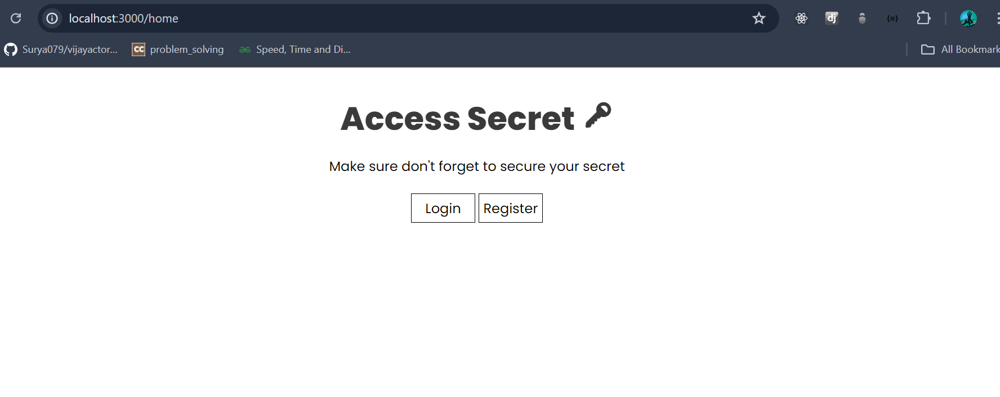
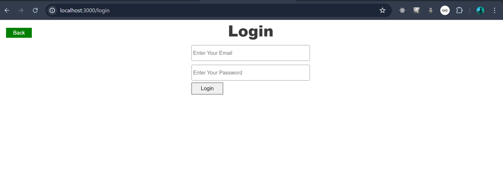
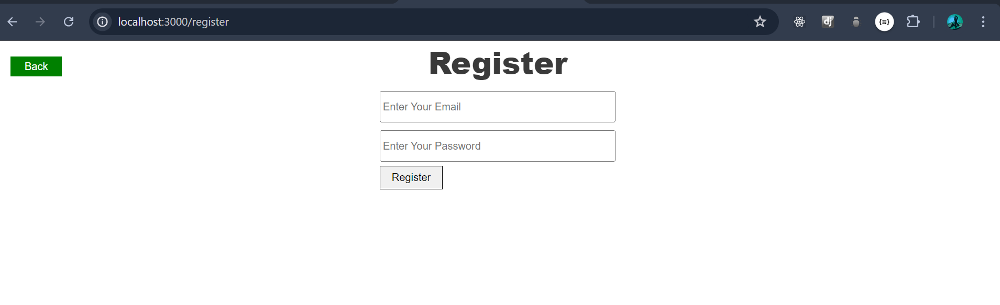
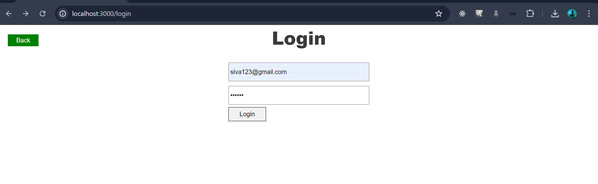
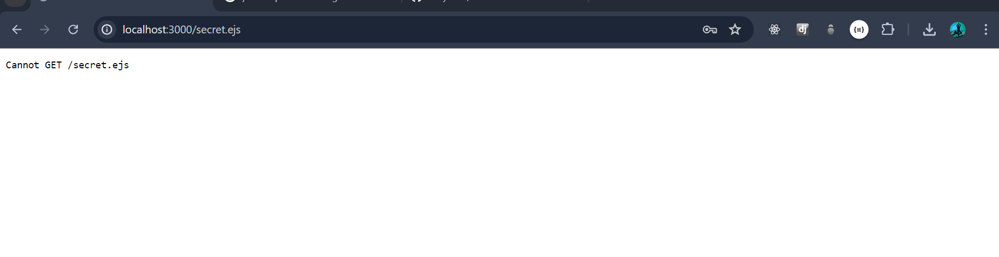
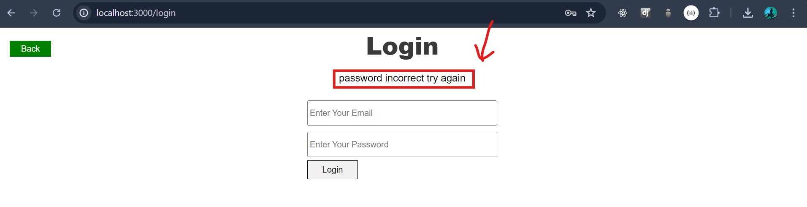
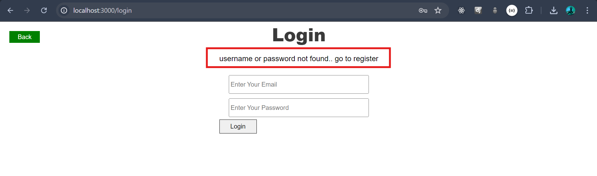
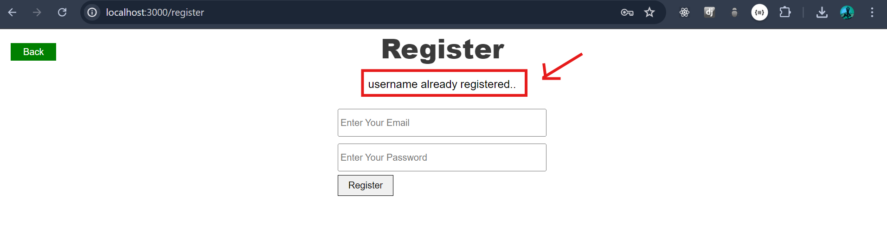

# Authentication Level -1

*  _we know the authentocation how advanced tech skill and secure of users data. Here, we get to know the 1st lvl of authendication. I mean, The user can login and register by email & password. Let's Go through how to achive!_

* _First we need to set up our server by using `node.js and express.js`._

## Home Page 

*  _we have  achive this by using `embedded javascript, node.js nad express.js` 

```
    app.get('/home', (req, res)=>{
        res.render("home.ejs")
    });

```




## Login page

```
    app.get('/login', (req, res)=>{
        res.render("login.ejs")
    });


```



## Register Page

```
    app.get('/register', (req, res)=>{
        res.render("register.ejs")
    });

```



## Database

* _Creating database for store username and password_
```
    create table users(
        id serial primary key,
        username varchar(45) not null unique,
        password varchar(100)
    )
```
## login 

*  _if user put username and password was correct, successfully login_ 


* _if login successfully, thats redirect secret `secret.ejs` page in our website_



## login with new user or password wrong

* _Incase of wrong username or password user getting given error message..._ 






## register 

* _The user given the input was found in database it's showing error given bellow.._



* _If user put new username or password, then they successfully register and thats redirect `secret.ejs`._

